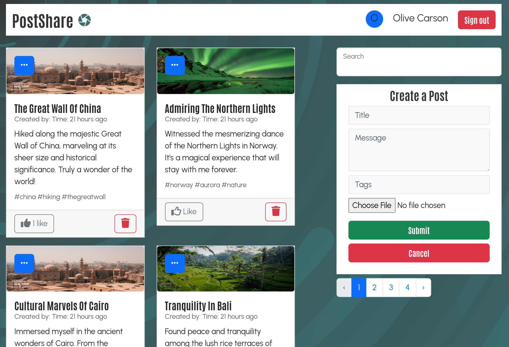

# PostShare

PostShare is a web application that enables users to share their thoughts through posts. Users can register, log in, create, update, or delete their posts, and interact with other users' posts by liking them.

### Screenshot

### Features

Users should be able to:

- Register and Log in
- Create Post
- Update Post
- Delete Posts
- Like Posts
- View Posts

### Technologies Used

- Frontend: React
- Backend: Node.js, Express.js
- Database: MongoDB
- Authentication: JSON Web Tokens (JWT)

